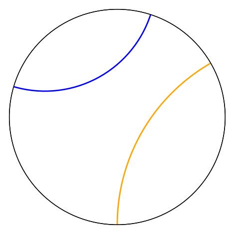
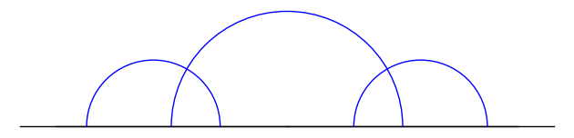
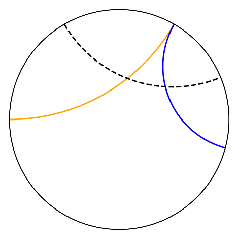
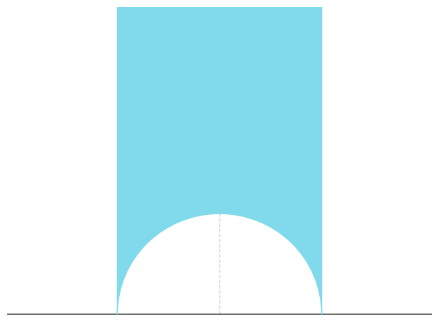
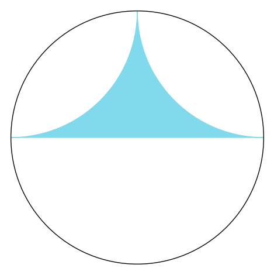
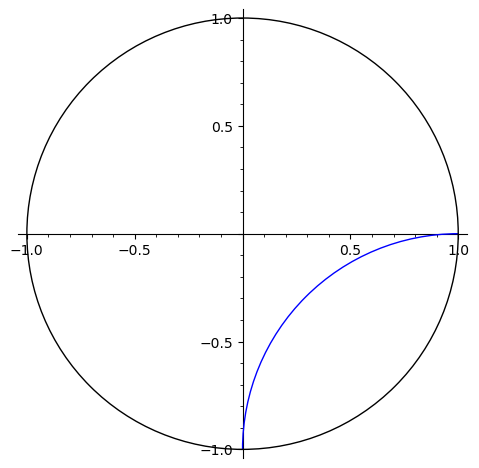
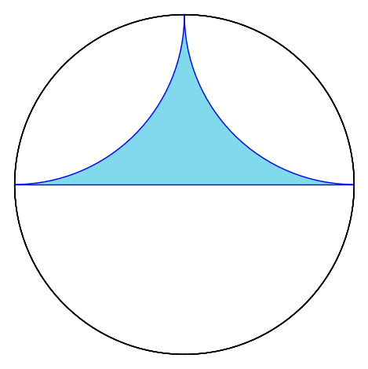
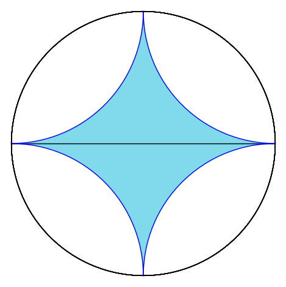

# 📋 IMPORTANT NOTE: Hyperbolic Diagram Functions Extracted

**All hyperbolic diagram functions from this notebook have been extracted and organized into:**
- **File**: `hyperbolic_diagrams.sage`
- **Location**: Same directory as this notebook

## Available Functions:
- `generate_asymptotically_parallel_svg()` - Creates asymptotically parallel geodesics
- `generate_ultraparallel_plane_model_svg()` - Creates ultraparallel geodesics in UHP
- `generate_hyperbolic_triangle_examples()` - Creates hyperbolic triangle examples  
- `do_reflect()` - Hyperbolic reflection function for tessellations
- `create_hyperbolic_tessellation()` - Complete tessellation generation
- `generate_all_hyperbolic_images()` - Convenience function to generate all images

## Usage:
```sage
load('hyperbolic_diagrams.sage')

# Generate all hyperbolic images
images = generate_all_hyperbolic_images()

# Or use individual functions
p = generate_asymptotically_parallel_svg("my_geodesics.svg")
tessellation = create_hyperbolic_tessellation(iterations=4)
```

⚠️ **The original code cells remain below for reference, but use the organized functions from the Sage file for new work.**

 


```python
# Import all Coxeter diagram functions and utilities
from isometry_utils import *

G = E8.genus()
G.representatives()
```


    ---------------------------------------------------------------------------

    ExceptionPexpect                          Traceback (most recent call last)

    File ~/gitclones/sage/src/sage/interfaces/expect.py:515, in Expect._start(self, alt_message, block_during_init)
        514 try:
    --> 515     self._expect = SageSpawn(cmd,
        516             logfile=self.__logfile,
        517             timeout=None,  # no timeout
        518             env=pexpect_env,
        519             name=self._repr_(),
        520             echo=self._terminal_echo,
        521             # Work around https://bugs.python.org/issue1652
        522             preexec_fn=lambda: signal.signal(signal.SIGPIPE, signal.SIG_DFL),
        523             quit_string=self._quit_string())
        525     # Attempt to shutdown the running process gracefully
        526     # when sage terminates.


    File ~/gitclones/sage/src/sage/interfaces/sagespawn.pyx:66, in sage.interfaces.sagespawn.SageSpawn.__init__()
         65 
    ---> 66         with ContainChildren(silent=True):
         67             spawn.__init__(self, *args, **kwds)


    File ~/gitclones/sage/src/sage/interfaces/sagespawn.pyx:67, in sage.interfaces.sagespawn.SageSpawn.__init__()
         66 with ContainChildren(silent=True):
    ---> 67     spawn.__init__(self, *args, **kwds)
         68 


    File ~/gitclones/sage/local/var/lib/sage/venv-python3.11.1/lib/python3.11/site-packages/pexpect/pty_spawn.py:205, in spawn.__init__(self, command, args, timeout, maxread, searchwindowsize, logfile, cwd, env, ignore_sighup, echo, preexec_fn, encoding, codec_errors, dimensions, use_poll)
        204 else:
    --> 205     self._spawn(command, args, preexec_fn, dimensions)
        206 self.use_poll = use_poll


    File ~/gitclones/sage/local/var/lib/sage/venv-python3.11.1/lib/python3.11/site-packages/pexpect/pty_spawn.py:276, in spawn._spawn(self, command, args, preexec_fn, dimensions)
        275 if command_with_path is None:
    --> 276     raise ExceptionPexpect('The command was not found or was not ' +
        277             'executable: %s.' % self.command)
        278 self.command = command_with_path


    ExceptionPexpect: The command was not found or was not executable: magma.

    
    During handling of the above exception, another exception occurred:


    RuntimeError                              Traceback (most recent call last)

    File ~/gitclones/sage/src/sage/interfaces/expect.py:1520, in ExpectElement.__init__(self, parent, value, is_name, name)
       1519 try:
    -> 1520     self._name = parent._create(value, name=name)
       1521 # Convert ValueError and RuntimeError to TypeError for
       1522 # coercion to work properly.


    File ~/gitclones/sage/src/sage/interfaces/interface.py:516, in Interface._create(self, value, name)
        515 def _create(self, value, name=None):
    --> 516     name = self._next_var_name() if name is None else name
        517     self.set(name, value)


    File ~/gitclones/sage/src/sage/interfaces/magma.py:1085, in Magma._next_var_name(self)
       1084 if self.__seq == 0:
    -> 1085     self.eval('_sage_ := [* *];')
       1086 else:


    File ~/gitclones/sage/src/sage/interfaces/magma.py:560, in Magma.eval(self, x, strip, **kwds)
        559     x += ';'
    --> 560 ans = Expect.eval(self, x, **kwds).replace('\\\n', '')
        561 if 'Runtime error' in ans or 'User error' in ans:


    File ~/gitclones/sage/src/sage/interfaces/expect.py:1414, in Expect.eval(self, code, strip, synchronize, locals, allow_use_file, split_lines, **kwds)
       1413 elif split_lines:
    -> 1414     return '\n'.join(self._eval_line(L, allow_use_file=allow_use_file, **kwds)
       1415                      for L in code.split('\n') if L)
       1416 else:


    File ~/gitclones/sage/src/sage/interfaces/expect.py:1414, in <genexpr>(.0)
       1413 elif split_lines:
    -> 1414     return '\n'.join(self._eval_line(L, allow_use_file=allow_use_file, **kwds)
       1415                      for L in code.split('\n') if L)
       1416 else:


    File ~/gitclones/sage/src/sage/interfaces/expect.py:992, in Expect._eval_line(self, line, allow_use_file, wait_for_prompt, restart_if_needed)
        991 if self._expect is None:
    --> 992     self._start()
        993 E = self._expect


    File ~/gitclones/sage/src/sage/interfaces/magma.py:601, in Magma._start(self)
        600 self._change_prompt('>')
    --> 601 Expect._start(self)
        602 self.eval('SetPrompt("%s"); SetLineEditor(false); SetColumns(0);' % PROMPT)


    File ~/gitclones/sage/src/sage/interfaces/expect.py:532, in Expect._start(self, alt_message, block_during_init)
        530     except (ExceptionPexpect, pexpect.EOF) as e:
        531         # Change pexpect errors to RuntimeError
    --> 532         raise RuntimeError("unable to start %s because the command %r failed: %s\n%s" %
        533                 (self.name(), cmd, e, self._install_hints()))
        534 except BaseException:


    RuntimeError: unable to start magma because the command 'magma -n' failed: The command was not found or was not executable: magma.


    
    During handling of the above exception, another exception occurred:


    TypeError                                 Traceback (most recent call last)

    Cell In[1], line 5
          2 from isometry_utils import *
          4 G = E8.genus()
    ----> 5 G.representatives()


    File ~/gitclones/sage/src/sage/quadratic_forms/genera/genus.py:3060, in GenusSymbol_global_ring.representatives(self, backend, algorithm)
       3058 if self.signature_pair_of_matrix()[1] != 0:
       3059     e = -1
    -> 3060 K = magma.Rationals()
       3061 gram = magma.Matrix(K, n, (e*self.representative()).list())
       3062 L = gram.LatticeWithGram()


    File ~/gitclones/sage/src/sage/interfaces/magma.py:1802, in MagmaFunction.__call__(self, *args, **kwds)
       1800         del kwds['nvals']
       1801 M = self._parent
    -> 1802 return M.function_call(self._name,
       1803                        list(args),
       1804                        params=kwds,
       1805                        nvals=nvals)


    File ~/gitclones/sage/src/sage/interfaces/magma.py:1170, in Magma.function_call(self, function, args, params, nvals)
       1165     par = ' : ' + ','.join('%s:=%s' % (a, b.name())
       1166                            for a, b in params.items())
       1168 fun = "%s(%s%s)" % (function, ",".join(s.name() for s in args), par)
    -> 1170 return self._do_call(fun, nvals)


    File ~/gitclones/sage/src/sage/interfaces/magma.py:1220, in Magma._do_call(self, code, nvals)
       1218     ans = None
       1219 elif nvals == 1:
    -> 1220     return self(code)
       1221 else:
       1222     v = [self._next_var_name() for _ in range(nvals)]


    File ~/gitclones/sage/src/sage/interfaces/magma.py:797, in Magma.__call__(self, x, gens)
        794 except TypeError:  # if x isn't hashable
        795     pass
    --> 797 A = Expect.__call__(self, x)
        798 if has_cache:
        799     x._magma_cache[self] = A


    File ~/gitclones/sage/src/sage/interfaces/interface.py:299, in Interface.__call__(self, x, name)
        296         pass
        298 if isinstance(x, str):
    --> 299     return cls(self, x, name=name)
        300 try:
        301     # Special methods do not and should not have an option to
        302     # set the name directly, as the identifier assigned by the
        303     # interface should stay consistent. An identifier with a
        304     # user-assigned name might change its value, so we return a
        305     # new element.
        306     result = self._coerce_from_special_method(x)


    File ~/gitclones/sage/src/sage/interfaces/expect.py:1525, in ExpectElement.__init__(self, parent, value, is_name, name)
       1523 except (RuntimeError, ValueError) as x:
       1524     self._session_number = -1
    -> 1525     raise TypeError(*x.args)
       1526 except BaseException:
       1527     self._session_number = -1


    TypeError: unable to start magma because the command 'magma -n' failed: The command was not found or was not executable: magma.


```python
As = [A1, ..., A20]
Ds = [D2, ..., D20]
Es = [E6, E7, E8]

As2 = [x.twist(2) for x in As]
Ds2 = [x.twist(2) for x in Ds]
Es2 = [x.twist(2) for x in Es]

n = 20 + 1
IPQs = [IPQ(p, q) for p in range(n) for q in range(n) if not (p == 0 and q == 0)]
IIPQs = [
    IIPQ(p, q)
    for p in range(n)
    for q in range(n)
    if not (p == 0 and q == 0) and p - q % 8 == 0
]

IPQs2 = [x.twist(2) for x in IPQs]
IIPQs2 = [x.twist(2) for x in IIPQs]

AllLats = As + Ds + Es + As2 + Ds2 + Es2 + IPQs + IIPQs + IPQs2 + IIPQs2
len(AllLats)
```


```python
from collections import defaultdict

lat_lookup = defaultdict(list)

for L in AllLats:
    (p, q) = L.signature_pair()
    lat_lookup[(p, q)].append(L)

sigs = Set(lat_lookup.keys())
sigs[0:10]
```


```python
p = 3
q = 5

print(len(sigs))
ok_sigs = list(filter(lambda x: x[0] <= p and x[1] <= q and x[0] + x[1] <= p + q, sigs))
print(len(ok_sigs))


def sumset(s):
    return reduce(lambda x, y: (x[0] + y[0], x[1] + y[1]), s)


sub_sigs = Subsets(ok_sigs)
print(sub_sigs.cardinality().factor())

correct_sigs = [s for s in sub_sigs if not s.is_empty() and sumset(s) == (p, q)]

Set(correct_sigs).cardinality().factor()
```


```python
L = A1.twist(-2) ** 3 @ D5
L
# Set(correct_sigs).cardinality().factor()
```


```python
correct_sigs
```


```python
# for sigs in correct_sigs[0:5]:
#     all_possibilities = list( itertools.product( *[ lat_lookup[sig] for sig in sigs] ) )
#     for s in all_possibilities:
#         L_pos = reduce( lambda a,b: a.direct_sum(b), s )
#         if L_pos.is_isometric(L):
#             print("Found isometry: ")
#             show(L)
#             break
```


```python
# All analysis functions and CoxeterGraph class are now imported from isometry_utils.py
# This includes: is_elliptic_matrix, is_parabolic_matrix, is_elliptic_subgraph,
# is_parabolic_subgraph, init_coxeter_colors, get_coxeter_label_connected,
# CoxeterGraph class with all methods (including to_tikz_labeled), m_lookup table, etc.

```


```python
# All Dynkin diagram and Coxeter graph functions are now imported from isometry_utils.py
# This includes: matrix_to_graph, graph_to_matrix, all A/B/C/D/E/F/G/H type functions,
# affine types (tilde functions), classification functions, and the CoxeterGraph class
```


```python
# All analysis functions and CoxeterGraph class are now imported from isometry_utils.py
# This includes: is_elliptic_matrix, is_parabolic_matrix, is_elliptic_subgraph,
# is_parabolic_subgraph, init_coxeter_colors, get_coxeter_label_connected,
# CoxeterGraph class with all methods (including to_tikz_labeled), m_lookup table, etc.


# [(m, cos(pi/(m+2))) for m in [0..10]]
# gij -> m
m_lookup = {
    0: 2,
    1 / 2: 3,
    1 / sqrt(2): 4,
    sqrt(3) / 2: 6,
    1: Infinity,
}

# Subsets have  X.lattice()                                                           # needs sage.combinat sage.graphs+
```


```python
show([TEn.q(x) for x in sterks2])

```


```python
G = TEn.gram_matrix()
Ginv = G.inverse()

e, f, ep, fp, a1, a2, a3, a4, a5, a6, a7, a8 = TEn.basis()
ed, fd, epd, fpd, a1d, a2d, a3d, a4d, a5d, a6d, a7d, a8d = (2 * Ginv).columns()

a9 = fp - ep
a10 = a8d + 2 * ep
a11 = 2 * ep + 2 * fp + a1d + a8d
a12 = a12 = 5 * ep + 3 * fp + 2 * a2d
sterks1 = [a1, a3, a4, a5, a6, a7, a8, a11, a10, a9, a12, a2]

# a9 = a8d + 2*f
# a10 = e-f
# sterks2 = [a1, ..., a10]

M = TEn.sub_gram_matrix(sterks1)

s1_pos = {
    0: [0, 0],
    1: [4, 0],
    2: [8, 0],
    3: [8, -4],
    4: [8, -8],
    5: [4, -8],
    6: [0, -8],
    7: [0, -4],
    8: [2, -6],
    9: [3.25, -4.75],
    10: [4.5, -3.5],
    11: [6, -2],
}

s2_pos = {
    0: [0, 0],
    2: [-4, 0],
    3: [-8, 0],
    4: [-7, 4],
    5: [-6, 8],
    6: [-5, 12],
    7: [-4, 16],
    8: [-3, 20],
    9: [-2, 24],
    1: [-2, 6],
}

G2 = CoxeterGraph(
    TEn.sub_gram_matrix(sterks2),
    pos=s2_pos,
    tex_title="Sterk 2",
    tikz_options={
        "scale": 1,
        "graphviz_scale": 0.2,
        "graphviz_width": 0.15,
        "scale_factor": 50,
        "scale_factor_labels": 50,
        "fontsize": 30,
        "tex_font_size": "Large",
        "edge_width": 1.2,
        "node_size": "0.5cm",
    },
)

G1 = CoxeterGraph(
    TEn.sub_gram_matrix(sterks1),
    pos=s1_pos,
    tex_title="Sterk 1",
    tikz_options={
        "scale": 2,
        "graphviz_scale": 0.2,
        "graphviz_width": 0.15,
        "scale_factor": 50,
        "scale_factor_labels": 53,
        "fontsize": 22,
        "tex_font_size": "tiny",
        "edge_width": 1.2,
        "node_size": "0.5cm",
    },
)


subgraphs = G1.orbits_of_subgraphs(representatives_only=True)
show(len(subgraphs))

# ell_subgraphs = G1.orbits_of_elliptic_subgraphs(fast=False)
# show(len(ell_subgraphs))

parab_subgraphs = G1.get_parabolic_subgraphs()
show(len(parab_subgraphs))

parab_subgraph_orbits = G1.orbits_of_parabolic_subgraphs()
show(len(parab_subgraph_orbits))

# show( G1.plot() )
# show( G2.plot() )
```


```python
print(all([is_elliptic_matrix(H.gram_matrix) for H in G1.get_elliptic_subgraphs()]))
print(all([is_parabolic_matrix(H.gram_matrix) for H in G1.get_parabolic_subgraphs()]))
print(
    all(
        [is_parabolic_matrix(H.gram_matrix) for H in G1.orbits_of_parabolic_subgraphs()]
    )
)
```


```python
# H = G1.get_random_subgraph(graph_type="Parabolic")
show(H.plot())
# print( H.to_dotfile() )

# H.gram_matrix
# for i in [1..30]:
#     show( G1.get_random_subgraph(graph_type="Elliptic").plot() )
is_parabolic_matrix(H.gram_matrix)
show(H.connected_components())

M1 = G1.subgraph([0, 1, 2, 3, 4, 5, 7]).gram_matrix
M2 = G1.subgraph([9, 10]).gram_matrix
print(M1)
print(M2)
print(is_parabolic_matrix(M1))
print(is_parabolic_matrix(M2))
print(M1.is_singular())
print(M2.is_singular())

# Degenerate and every component is PSD
# Degenerate and every subdiagram is elliptic
```


```python
H = G1.subgraph([0, 1, 2, 7, 11, 8, 5, 4])
# G1.to_tikz_labeled(subgraph=H, tikz_options = {
#         "scale": 2,
#         "graphviz_scale": 0.2,
#         "graphviz_width": 0.15,
#         "scale_factor": 50,
#         "scale_factor_labels": 53,
#         "fontsize": 2,
#         "tex_font_size": "tiny",
#         "edge_width": 1.2,
#         "node_size": "0.5cm",
#     })

G1.plot(subgraph=H)

ells = list(reversed(sorted(ell_subgraphs.maximal_elements(), key=len)))
H = ells[0]
G1.plot(subgraph=H)  # .save(f'S1_H{i}.png')
```


```python
s = ""
ells = list(reversed(sorted(ell_subgraphs.maximal_elements(), key=len)))
for i, H in enumerate(ells):
    G1.plot(subgraph=H).save(f"S1_H{i}.png")
    s += f"""
\\begin{{minipage}}[c]{{0.25\\textwidth}}
\\includegraphics[width=\\textwidth]{{S1_H{i}.png}}
\\end{{minipage}}
    """.rstrip()
    if (i + 1) % 4 == 0:
        s += "\n\\vspace{1em}\n"

print(s)
```

                     


```python
subgraphs = G.orbits_of_subgraphs(representatives_only=True)
subgraphs
nontrivial_subgraphs = [H for H in subgraphs if len(H) > 0]
elliptic_subgraphs = filter(lambda H: is_elliptic_subgraph(H), nontrivial_subgraphs)
only_connected = False
if only_connected:
    elliptic_subgraphs = filter(lambda H: H.is_connected(), elliptic_subgraphs)

fast = False
if fast:
    elliptic_subgraphs = lmap(lambda H: Set(H.vertices()), elliptic_subgraphs)
    B = Poset((elliptic_subgraphs, lambda h0, h1: h0.issubset(h1)))
else:
    B = Poset(
        (
            set(elliptic_subgraphs),
            lambda x, y: all([v in y.vertices() for v in x.vertices()]),
        )
    )
B.cardinality()
B
```


```python
elliptic_subgraphs = filter(lambda H: is_elliptic_subgraph(H), nontrivial_subgraphs)
elliptic_subgraphs = lmap(lambda H: Set(H.vertices()), elliptic_subgraphs)
h0 = elliptic_subgraphs[0]
h1 = elliptic_subgraphs[1]

h0.issubset(h1)
```


```python
Hp = CoxeterSubgraph(H)

subgraphs = G.orbits_of_subgraphs(representatives_only=True)

nontrivial_subgraphs = [H for H in subgraphs if len(H) > 0]
elliptic_subgraphs = filter(lambda H: is_elliptic_subgraph(H), nontrivial_subgraphs)

els = lmap(lambda H: H, elliptic_subgraphs)

print(len(els))


def compare_subgraphs(x, y):
    return Set(x.vertices()).issubset(Set(y.vertices())) and Set(x.edges()).issubset(
        Set(y.edges())
    )


B = Poset((set(els), compare_subgraphs))
B
# hash(Hp)
# frozenset( H.edges() ).union( frozenset( H.vertices() ) )
# hash( frozenset( H.edges() ) )
# hash( lmap(lambda s: str(s), list(H.edges()) ) )
```


```python
?Poset
```


```python
print(H.to_dotfile())
```


```python
subgraphs = G.get_subgraphs()
AutG = G.automorphism_group()
int_orbits = set()
for H in subgraphs:
    orb = AutG.orbit(tuple(H.vertices()), action="OnSets")
    lp = sorted([tuple(sorted(l)) for l in orb])
    int_orbits.add(tuple(lp))

# int_orbits.
# graph_orbits = set()
# for some_orbs in int_orbits:
#     # selg.subgraph(x).copy(immutable=True)
#     # Orbit calculation needs immutable objects => hashable
#     ls = lmap( lambda x: self.subgraph(x), some_orbs)
#     graph_orbits.add(tuple(ls))
# [x[0]for x in graph_orbits]


graph_orbits = Set(
    [tuple(map(lambda x: G.subgraph(x), some_orbs)) for some_orbs in int_orbits]
)
print(graph_orbits.cardinality())

reps = [x[0] for x in graph_orbits]
len(reps)
```


```python
G._default_options["vertex_colors"]
# show( G._default_options )
# show( G.gram_matrix )
# show( init_coxeter_colors(G) )
H = G.subgraph([1, 2, 3, 6, 9])
# G.pos
# G._default_options["vertex_colors"]
H.plot()
# show( init_coxeter_colors(H) )
# Hp.vertices()
# Hl = H.graphplot(save_pos=True)
# Hl.set_pos(pos=pos_dict)
# G.get_pos()
# print(pos_dict)
# subs_pos_dict = {x:pos_dict[x] for x in pos_dict if x in H.vertices()}
# show( Hp.plot(pos=subs_pos_dict, vertex_colors = G._default_options["vertex_colors"]) )

# show( H.vertices() )
# d = {'#FF0000': [1,2,3,6], '#FF9900': [9], '#FFFF00': [],
#       '#00FF00': [], '#0000FF': []}

# vcs = G._default_options["vertex_colors"]

H._default_options

# d = {}
# for x in vcs:
#     k = vcs[x]
#     A = Set( H.vertices() )
#     B = Set( vcs[x] )
#     C = A.intersection(B)
#     d[x] = list(C)

# show(d)
# Hp.plot(vertex_colors = d)
# #show( init_coxeter_colors(H) )
```


```python
Set(H.vertices())

{x: vcs[x] for x in vcs}

d = {}
for x in vcs:
    k = vcs[x]
    A = Set(H.vertices())
    B = Set(vcs[x])
    C = A.intersection(B)
    d[x] = list(C)

d

# vcs = G._default_options["vertex_colors"]
# {x: vcs[x] for x in vcs if not Set( H.vertices()).intersection( Set(vcs[x]) ).is_empty()  }
```


```python
S = Set([1, 2])
T = Set([2, 3])
S.intersection(T).is_empty()

# {x:pos_dict[x] for x in pos_dict if x in H.vertices()}
```


```python
Gp = G.graphplot()
pos_dict = G.graphplot()._pos
pos_dict
```


```python
import random

H = random.choice(ell_subgraphs)
H = G.subgraph([1, 2, 3, 6, 9])
H.plot()
# H.plot()
```


```python
# H.vertices()
Gp = G.graphplot()
Gp._pos
# H.edges()
# H.plot(title="ASdsa")
```


```python
# subgraphs
# sg = ell_subgraphs[5]
# sg.plot()
# sg.plot()
# G.plot()

sgp = G.subgraph([3, 2, 0, 10, 7])
sp = CoxeterGraph(sgp)


Gp = Graph(multiedges=True)

for e in [e for e in sg.edges() if e[0] != e[1]]:
    v1 = e[0]
    v2 = e[1]
    v1_v2 = e[2]
    v1_2 = [e for e in sg.edges_incident(v1) if e[0] == v1 and e[1] == v1][0][2]
    v2_2 = [e for e in sg.edges_incident(v2) if e[0] == v2 and e[1] == v2][0][2]
    # print(f' {v1}({v1_2}) ---- {v1_v2} ---- {v2}({v2_2}) ')
    g12 = int(v1_v2) / sqrt(int(v1_2) * int(v2_2))
    if g12 > 1:
        # print(f'Dotted Edge labeled {g12}')
        Gp.add_edge(v1, v2, g12)
    elif g12 == 1:
        # print(f'm = {m_lookup[g12]}')
        # print("Thick/Infinite Edge")
        Gp.add_edge(v1, v2, "∞")
    elif g12 < 1:
        # print(g12)
        # g12_p = cos(g12)
        # print(g12_p)
        # m = ( pi / arccos( g12) ) -2
        m = m_lookup[g12]
        # print(f'm = {int( m_lookup[g12] )}')
        # print(f'{m}-fold edge')
        for i in range(m - 2):
            Gp.add_edge(v1, v2, "")
    else:
        raise ValueError("Unknown entry.")

pl = Gp.plot()
pl.show(figsize=10)
```


```python
type(sgp)
# sgp.plot()
# ell_subgraphs_as_verts = [Set(x.vertices()) for x in ell_subgraphs]
# B = Poset((ell_subgraphs_as_verts, lambda x,y: x.issubset(y)))
# show( len( B.maximal_elements() ) )

# B = Poset(
#     (ell_subgraphs, lambda x,y:
#      Set( x.vertices() ).issubset( Set(y.vertices() ) ) and
#      Set( x.edges() ).issubset( Set(y.edges() ) )
#     )
# )
# len( B.maximal_elements() )

# B
```


```python
b = B[200]

d = dict(lmap(lambda H: (H, H.vertices()), B.order_filter([b])))
P = B.subposet(B.order_filter([b]))
P.plot(element_labels=d)
```


```python
B.zeta_polynomial()
```


```python
l1 = G.subgraph([6, 7, 8, 9])
l2 = G.subgraph([7, 8, 9])
# l1 = ell_subgraphs[35]
# l2 = [x for x in subgraphs if Set(x.vertices()).issubset( Set(l1.vertices())) ][1]

show(l1.vertices())
show(l2.vertices())


show(Set(l2.vertices()).issubset(Set(l1.vertices())))

# show(l1)
# print("------------")
# show(l2)

show(Set(l2.edges()).issubset(Set(l1.edges())))

# all([l1.is_subgraph(x) for x in ell_subgraphs])

# lp = G.subgraph(ell_subgraphs[35].vertices())

# l1.plot(vertex_colors=None, edge_labels=True)
show(l1.old_plot().plot())
# G.underlying_graph
```


```python

```


```python
show(l2.edges())
show(G.edges())
```


```python
print(ell_subgraphs[5].vertices())

l1 = Set(ell_subgraphs[5].vertices())
Set([0, 1, 2]).issubset(l1)
show(l1)

l2 = [Set(x.vertices()) for x in ell_subgraphs if Set(x).issubset(l1)][5]
show(l2)
# ell_subgraphs[40].vertices()
# G.num_verts()

# ell_subgraphs_as_verts = lmap(lambda x: tuple(x.vertices()), ell_subgraphs)[0:10]
# ell_subgraphs_as_verts
G = [l1, l2]
show(G)
```


```python
S = Subsets([1,..,5])
G = [t for t in S if sum(t)<=3]
show(S)
show(G)
#Poset((G, lambda x,y: x.issubset(y)))
```


```python
# B = posets.BooleanLattice(G.num_verts(), )
B = Poset(([l1, l2], lambda x, y: x.issubset(y)))
B.maximal_elements()
```


```python
nontrivial_subgraphs
# g=libgap.SymmetricGroup(7)
# n = G.num_verts()
# g.Orbits(tuples([1..n]), libgap.OnTuples)
# Subsets([1..n])
# G = libgap.SymmetricGroup(4)
# ss = Subsets([1,2,3,4])
# show(len(ss))

# G.plot()

# nontrivial_subgraphs = [H for H in subgraphs if len(H) > 0]
# elliptic_subgraphs = filter(lambda H: is_elliptic_subgraph(H), nontrivial_subgraphs)
# list(reversed(sorted(elliptic_subgraphs, key=len)))
# ?AutG.orbits(, OnSetsSets)


# sgs = G.get_subgraphs(only_connected = True, limit=10)
AutG = G.automorphism_group()

# table([(g, im(g)) for g in G])
T1 = libgap.Group(AutG.gens())
# T2 = libgap.Group(map(libgap, AutG.gens()))

T2 = libgap.Group(lmap(libgap, AutG.gens()))

# T1.order()
T2.Order()

# orbs = G.orbits_of_subgraphs()

# show(len(G.orbits_of_elliptic_subgraphs()))
# show(len(orbs))
# orbs

# Orbit(H,Set([Set([G.1,G.1*G.2]),Set([G.1,G.2])]),OnSetsSets); works –


# gfs = G.get_subgraphs()
# factor( len(gfs) )

# orbs = libgap.Orbit( G, sg, action = "OnSetsSets" )

# AutG.orbit(gfs, action = "OnSetSets")

# len(orbs)
# orbs
# g = libgap.Group( (1,2,3), (2,3,4) );;
# libgap.Orbit( g, [ [ 1, 2 ], [ 3, 4 ] ], OnSetsSets );

# orbits = set()

# gfs = G.get_subgraphs(limit=10)

# for H in gfs:
#     orb = AutG.orbit( tuple(H.vertices() ), action = "OnSets")
#     lp = sorted( [ tuple( sorted(l) ) for l in orb] )
#     orbits.add(tuple( lp ))

# print(len(gfs))
# print(len(orbits))
# [x[0] for x in orbits]
```


```python
for x in orbits:
    print(x)
    print("-----")
```


```python
L = TEn
G = TEn.gram_matrix()
Ginv = G.inverse()

(
    e,
    f,
    ep,
    fp,
    a1,
    a2,
    a3,
    a4,
    a5,
    a6,
    a7,
    a8,
) = TEn.basis()

te = e + ep + fp - a1
tf = f + ep + fp - a1

ta1 = ep - fp
ta2 = a2
ta3 = fp + a3
ta4 = a4
ta5 = a5
ta6 = a6
ta7 = a7
ta8 = a8

ted, tfd, ta1d, ta2d, ta3d, ta4d, ta5d, ta6d, ta7d, ta8d = (
    L.sub_gram_matrix([te, tf, ta1, ta2, ta3, ta4, ta5, ta6, ta7, ta8])
    .inverse()
    .columns()
)

a9 = 2 * te - ta1
a10 = 2 * te + 2 * (ta2d - ta3d)
a11 = tf - te
a12 = ed + fd + 2 * (tilde_a6d - tilde_a3d)
a13 = te + tf + 2 * (ta1d + ta8d - ta3d)
a14 = te + tf + ta3
sterks5 = [a2, a4, a5, a6, a7, a8, ta8d, a10, a11, a12, a13, a14, ta1, a9]


sterks5

# f*fp + 2*a8d

matrix_to_graph(TEn.sub_gram_matrix(sterks3)).plot()

# M = L.sub_gram_matrix(sterks1)
# show( M)
# show( type(M) )
# show( isinstance(M, sage.matrix.matrix_integer_dense.Matrix_integer_dense) )

# Lp = L.submodule(L.span(sterks1))
# print( type(Lp) )
# isinstance(Lp, sage.modules.free_quadratic_module.FreeQuadraticModule_generic_pid)
# Lp.gram_matrix()

# L = E10_2
# G = CoxeterGraph(L)
# G.plot()
# (1) == (pi/arccos( L.b(s1, s2) / sqrt( L.q(s1) * L.q(s2) ))) -2
# L.<e,f> = U
# L = U
# L.<s1, s2, l1, l2> = IntegralLattice( matrix(ZZ, 4, [-2,1,0,0, 1,-2,0,0, 0,0,-4,2, 0,0,2,-4]))
# L.<a1, a2, a3, a4, d1, d2, d3, d4, e1, ..., e8> = A4 @ D4 @ E8
# G = CoxeterGraph(L)
# G.plot(layout='graphviz', edge_labels=True)
# G.plot(edge_labels_background="white")
```


```python

L.<e,f,a1, ..., a8> = U @ E8_2

ed, fd, a1d, a2d, a3d, a4d, a5d, a6d, a7d, a8d = L.gram_matrix().inverse().columns()

a9 = 2*e - a1
a10 = 2*e + 2*(a2d - a3d)
a11 = f - e
a12 = e + f + 2*(a6d - a3d)
a13 = e + f + 2*(a1d + a8d - a3d)
a14 = e + f + a3
sterks5=[a2, a4, a5, a6, a7, a8, 2*a8d, a10, a11, a12, a13, a14, a1, a9]


```


```python
G = Graph()
G.add_edge(0, 1, 2)
G.add_edge(1, 2, 3)
print(G.edges())

e0 = G.edges()[0]
e1 = G.edges()[1]
print(e0)
print(e1)

es = dict({e0: "-", e1: "-"})
# G.plot(edge_styles = es)
# Need updates Sage
```


```python
# g = Graph(loops=True, multiedges=True, sparse=True)
# g.add_edges([(0, 0, 'a'), (0, 0, 'b'), (0, 1, 'c'),
#           (0, 1, 'd'), (0, 1, 'e'), (0, 1, 'f'),
#           (0, 1, 'f'), (2, 1, 'g'), (2, 2, 'h')])
# GP = g.graphplot(vertex_size=100, edge_labels=True,
#               color_by_label=True, edge_style='dashed')
# GP.set_edges(edge_styles={'a':'dashed', 'g':'dotted'})
# GP.plot()
```


```python
# g.set_latex_options(tkz_style='Classic')
# from sage.graphs.graph_latex import check_tkz_graph
# check_tkz_graph()  # random - depends on TeX installation
# latex(g)

```


```python
# def to_tikz(graph, subgraph=None, scale=1, merge_multiedges=False,
#                             merge_label_function=tuple):

#     graph_to_plot = graph.coxeter_graph
#     pos = graph.get_pos()
#     if pos is None:
#         raise ValueError('vertex positions need to be set first')
#     keys_for_vertices = lambda u: u
#     lines = []
#     lines.append(r'\begin{tikzpicture}')
#     # lines.append(r'[auto,scale={}]'.format(scale))
#     lines.append(f'[auto, scale={scale}, every node/.style={{scale={scale}}}]')
# # ,scale=0.6, every node/.style={scale=0.6}
#     # vertices
#     lines.append(r'% vertices')
#     lines.append(r'\begin{pgfonlayer}{nodelayer}')
#     for u in graph_to_plot.vertices(sort=False):
#         v2 = [x for x in graph.edges() if x[0] == x[1] and x[1] == u][0][2]
#         color = "black" if v2 == -4 else "white"
#         line = f'\\node [style={color} node, label={{[label distance=0.25cm]30:{keys_for_vertices(u)} }}] ({keys_for_vertices(u)}) at {tuple(pos[u]) } {{}};'
#         lines.append(line)
#     lines.append(r'\end{pgfonlayer}')

#     # edges
#     lines.append(r'% edges')
#     #arrow = '->' if graph.is_directed() else ''
#     #arrow = ''

#     num_edges = Counter( graph_to_plot.edges() )
#     #print(num_edges)
#     lines.append(r'\begin{pgfonlayer}{edgelayer}')
#     for (u, v, label) in num_edges: #graph_to_plot.edges(sort=True):
#         if u == v:
#             # loops are done below
#             continue
#         if num_edges.get((u, v,label)) == 2:
#             # label={[label distance=1cm]30:label}]
#             line = f'\\draw [style=double edge] ({keys_for_vertices(u)}) -- ({keys_for_vertices(v)});'
#         else:
#             line = f'\\draw [style=plain edge] ({keys_for_vertices(u)}) -- ({keys_for_vertices(v)});'
#         lines.append(line)

#     # loops
#     lines.append(r'% loops')
#     for (u, v, label) in graph_to_plot.loop_edges():
#         line = r'\draw ({}) edge [loop above] node {{{}}} ();'.format(
#             keys_for_vertices(u), label)
#         lines.append(line)
#     lines.append(r'\end{pgfonlayer}')


#     # Highlights
#     if subgraph is not None:
#         lines.append(r'% highlights')
#         lines.append(r'\begin{pgfonlayer}{background}')
#         lines.append(r'\begin{scope}[transparency group, opacity=0.5]')
#         for (u, v, label) in subgraph.edges():
#             if u == v:
#                 line = f'\\filldraw[cyan] ({keys_for_vertices(u)}) circle (8pt);'
#             else:
#                 line = f'\\fill[cyan] \\convexpath{{{keys_for_vertices(u)},{keys_for_vertices(v)}}}{{8pt}};'
#             lines.append(line)

#         lines.append(r'\end{scope}')
#         lines.append(r'\end{pgfonlayer}')
#     lines.append(r'\end{tikzpicture}')
#     tikz = '\n'.join(lines)

#     return TikzPicture(
#         tikz, standalone_config=["border=4mm"],
#         usetikzlibrary=['arrows', 'calc', 'positioning'],
#         usepackage=['amsmath', 'mathptmx', 'color', '/home/dzack/Notes/tikzit',
#                     '/home/dzack/Notes/DZG_Style_Tikz_Only', 'tikz-cd', 'pgfplots' ])
```


```python
# Load the hyperbolic plane in the Poincaré Disc model
H = HyperbolicPlane().PD()

# Define two intersecting geodesics in the disc
g1 = H.get_geodesic(-I, exp(2 pi I / 12) )      # Geodesic connecting points inside the unit disc
g2 = H.get_geodesic(exp(2 pi I / 2.2), exp(2 pi I / 5))      # Another geodesic intersecting the first

#Plot all three geodesics
plot = g1.plot(color='orange', thickness=2) + \
g2.plot(color='blue', thickness=2) 
#g3.plot(color='red', linestyle='--', thickness=2)


plot.show()
```


    

    


```python
UHP = HyperbolicPlane().UHP()
g = UHP.get_geodesic(2, 3)
h = UHP.get_geodesic(4, 5)
perp = g.common_perpendicular(h)

g.plot() + h.plot() + perp.plot()
```


    

    


```python
# Load the hyperbolic plane in the Poincaré Disc model
H = HyperbolicPlane().PD()
import cmath

# Step 1: Define two hyperbolic geodesics with endpoints on the boundary (non-intersecting)

tz1, tz2 = 2 pi I / 6, 2 pi I / 2
z1, z2 = exp(tz1), exp(tz2)

tw1, tw2 = 2 pi I / 6, -2 pi I/24
w1, w2 = exp(tw1), exp(tw2)

g1 = H.get_geodesic(z1, z2)
g2 = H.get_geodesic(w1, w2)


# Step 4: Create the common perpendicular geodesic
g3 = H.get_geodesic(exp((tz1 + tz2)/2), exp((tw1 + tw2)/2))

# Plot all three geodesics
plot = (
    g1.plot(color='orange', thickness=2, legend_label='g1') +
    g2.plot(color='blue', thickness=2, legend_label='g2') +
    g3.plot(color='red', linestyle='--', thickness=2, legend_label='common perpendicular')
)

#plot.show()
p = g1.plot(color="orange", thickness=2) + g2.plot(color="blue", thickness=2) + g3.plot(color="black", linestyle="--", thickness=2)
#p.save_image("Ultraparallel.svg")
p
```


    

    


```python
# Load the hyperbolic plane in the Poincaré Disc model
H = HyperbolicPlane().PD()
import cmath

# Step 1: Define two hyperbolic geodesics with endpoints on the boundary (non-intersecting)

tz1, tz2 = 2 pi I / 6, 2 pi I / 2
z1, z2 = exp(tz1), exp(tz2)

tw1, tw2 = 2 pi I / 6, -2 pi I/24
w1, w2 = exp(tw1), exp(tw2)

g1 = H.get_geodesic(z1, z2)
g2 = H.get_geodesic(w1, w2)


# Step 4: Create the common perpendicular geodesic
#g3 = H.get_geodesic(exp(2 pi I/6), exp(2 pi I / 6.1) )
s=0.6
t=-1/2
g3 = line([ (1/2)*(1+3t) + I sqrt(3)/2 *(1-t), (1/2)*(1+3s) + I sqrt(3)/2 *(1-s) ], linestyle="--", color="black", thickness=2)


#plot.show()
p = g1.plot(color="orange", thickness=2) + g2.plot(color="blue", thickness=2) + g3.plot()
p.save_image("asymptotically_parallel.svg")
#p
```


```python
g3[0].options()
```


    {'alpha': 1,
     'rgbcolor': 'black',
     'thickness': 2,
     'legend_label': None,
     'legend_color': None,
     'linestyle': '--'}


```python

```


```python
# Load the hyperbolic plane in the Poincaré Disc model
H = HyperbolicPlane().UHP()

# Step 1: Define two hyperbolic geodesics with endpoints on the boundary (non-intersecting)

g1 = H.get_geodesic(-1, 3)
g2 = H.get_geodesic(-3, -2)


# Step 4: Create the common perpendicular geodesic
#g3 = H.get_geodesic(exp(2 pi I/6), exp(2 pi I / 6.1) )
s=0.6
t=-1/2
#g3 = line([ (1/2)*(1+3t) + I sqrt(3)/2 *(1-t), (1/2)*(1+3s) + I sqrt(3)/2 *(1-s) ], linestyle="--", color="black", thickness=2)
g3 = line([0, 3 I], linestyle="--", alpha=0.2, color="black")

g4 = g1.common_perpendicular(g2)

a1c = g1.intersection(g4)[0].coordinates()

#a1 = arrow((a1c.real_part(), a1c.imag()), (a1c.real_part() - 0.7, a1c.imag() + 0.4), color="red", arrowsize=3)


p = g1.plot(color="orange", thickness=2, ymin=-0.2, xmin=-4, xmax=4) + g2.plot(color="blue", thickness=2) + g3.plot() + g4.plot(linestyle="--", color="black") #+ a1.plot()
p.save_image("ultraparallel_plane_model.svg")
```


```python
# Load the hyperbolic plane in the Poincaré Disc model
H = HyperbolicPlane().UHP()

# Step 1: Define two hyperbolic geodesics with endpoints on the boundary (non-intersecting)

g1 = H.get_geodesic(-3, 3)
g2 = H.get_geodesic(-3, 1)


# Step 4: Create the common perpendicular geodesic
#g3 = H.get_geodesic(exp(2 pi I/6), exp(2 pi I / 6.1) )
s=0.6
t=-1/2
#g3 = line([ (1/2)*(1+3t) + I sqrt(3)/2 *(1-t), (1/2)*(1+3s) + I sqrt(3)/2 *(1-s) ], linestyle="--", color="black", thickness=2)
g3 = line([0, 4 I], linestyle="--", alpha=0.2, color="black")
g4 = line([-3 -0.4 I, -3 + 4 I], linestyle="--", color="black")


#g4 = g1.common_perpendicular(g2)

a = arrow((-2, 0), (-3, 0), color="red", arrowsize=3)

p = g1.plot(color="orange", thickness=2, ymin=-0.2, xmin=-4, xmax=4) + g2.plot(color="blue", thickness=2) + g3.plot() +g4.plot() #+ a.plot() #+ g4.plot(linestyle="--", color="black") + 
p#.save_image("asymptotically_parallel_plane_model.svg")
```


```python
a = arrow((0, 0), (-1, 0), color="red")
a.plot()
```


```python

```


```python

hyperbolic_triangle(exp(2 pi I/2), exp(2 pi I / 3), 1, model='PD', color='cyan', fill=True, resolution=200)

```


```python
print(plt.style.available)

```


```python
hyperbolic_triangle(
    -1,
    Infinity,
    1,
    fill=true,
    rgbcolor="#80DAEB",
    resolution=200,
    xmin=-2,
    xmax=2,
    ymax=3,
)

```


```python
import matplotlib.pyplot as plt
import numpy as np

plt.style.use('seaborn-v0_8-dark-palette')

tri = hyperbolic_triangle(-1, Infinity, 1, fill=true, rgbcolor='#80DAEB', resolution=200, xmin=-2, xmax=2, ymax=3, axes=False)
g4 = line([-3, 3], color="black", axes=False)
g5 = line([0, 5 I], color="black", axes=False, linestyle="--", alpha=0.2)

g4.axes(False)
g4.plot() + g5.plot() + tri.plot()
```


    

    


```python
UHP = HyperbolicPlane().UHP()
PD = HyperbolicPlane().PD()
p1 = UHP.get_point(-1).to_model(PD)
p2 = UHP.get_point(1).to_model(PD)
p3 = UHP.get_point(Infinity).to_model(PD)

tri = hyperbolic_triangle(
    p1.coordinates(),
    p2.coordinates(),
    p3.coordinates(),
    model="PD",
    fill=True,
    rgbcolor="#80DAEB",
    axes=False,
)
tri
```


    

    


```python
g1 = PD.get_geodesic(-1, I)
g2 = PD.get_geodesic(I, 1)
g3 = PD.get_geodesic(1, -1)
inv11 = g11.reflection_involution()
plot(inv11 * g2)
```


    

    


```python
allpts = []
allgeos = []

p1 = UHP.get_point(-1).to_model(PD)
p2 = UHP.get_point(1).to_model(PD)
p3 = UHP.get_point(Infinity).to_model(PD)

allpts += [(p1, p2, p3)]

tri1 = hyperbolic_triangle(
    p1.coordinates(),
    p2.coordinates(),
    p3.coordinates(),
    model="PD",
    fill=True,
    rgbcolor="#80DAEB",
    axes=False,
)

inv11 = g11.reflection_involution()

g1 = PD.get_geodesic(p1.coordinates(), p2.coordinates(), color="blue", axes=False)
g2 = PD.get_geodesic(p2.coordinates(), p3.coordinates(), color="blue", axes=False)
g3 = PD.get_geodesic(p3.coordinates(), p1.coordinates(), color="blue", axes=False)

allgeos += [(g1, g2, g3)]

tri1 += g1.plot() + g2.plot() + g3.plot()

# tri2 = hyperbolic_triangle(inv11 * p1, inv11 * p2, inv11 * p3, model="PD", fill=True, rgbcolor="#80DAEB", axes=False)
# tri1.plot() + tri2.plot()

g1p = inv11 * g1
g2p = inv11 * g2
g3p = inv11 * g3

# ip1 = g1p.intersection(g2p)


# tri2 = hyperbolic_triangle(inv11 * p1, inv11 * p2, inv11 * p3, model="PD", fill=True, rgbcolor="#80DAEB", axes=False)
# tri1.plot() + (inv11 * g1).plot() + (inv11 *g2).plot() + (inv11 *g3).plot()
tri1
```


    

    


```python
newpoints = list(
    Set(
        [
            g1p.start().coordinates(),
            g1p.end().coordinates(),
            g2p.start().coordinates(),
            g2p.end().coordinates(),
            g3p.start().coordinates(),
            g3p.end().coordinates(),
        ]
    )
)
newpoints
```


    [1, -I, -1]


```python
tri2 = hyperbolic_triangle(
    newpoints[0],
    newpoints[1],
    newpoints[2],
    model="PD",
    fill=True,
    rgbcolor="#80DAEB",
    axes=False,
)
tri1 += tri2 + g1p.plot() + g2p.plot() + g3p.plot()

tri1
```


    

    


```python
g2.is_asymptotically_parallel(g3)
```


    True


```python

basealpha=1.0

def do_reflect(p1, p2, p3):
    global allpts
    global basealpha

    #basealpha = basealpha/1.5
    
    g1 = PD.get_geodesic(p1, p2, color="blue", axes=False)
    g2 = PD.get_geodesic(p2, p3, color="blue", axes=False)
    g3 = PD.get_geodesic(p3, p1, color="blue", axes=False)
    
    inv1 = g1.reflection_involution()
    inv2 = g2.reflection_involution()
    inv3 = g3.reflection_involution()

    g1p = inv1 * g1
    g2p = inv1 * g2
    g3p = inv1 * g3
    
    newpoints = tuple( Set([g1p.start().coordinates(), g1p.end().coordinates(), g2p.start().coordinates(), g2p.end().coordinates(), g3p.start().coordinates(), g3p.end().coordinates()]))
    allpts.append(newpoints)

    t1 = hyperbolic_triangle(newpoints[0],newpoints[1],newpoints[2], model="PD", fill=True, rgbcolor="#80DAEB", axes=False, alpha=basealpha, resolution=400)
    t1 += g1p.plot(color="blue", axes=False) + g2p.plot(color="blue", axes=False) + g3p.plot(color="blue", axes=False)

    g1p = inv2 * g1
    g2p = inv2 * g2
    g3p = inv2 * g3

    newpoints = tuple( Set([g1p.start().coordinates(), g1p.end().coordinates(), g2p.start().coordinates(), g2p.end().coordinates(), g3p.start().coordinates(), g3p.end().coordinates()]))
    allpts.append(newpoints)

    t2 = hyperbolic_triangle(newpoints[0],newpoints[1],newpoints[2], model="PD", fill=True, rgbcolor="#80DAEB", axes=False, alpha=basealpha, resolution=400)
    t2 += g1p.plot(color="blue", axes=False) + g2p.plot(color="blue", axes=False) + g3p.plot(color="blue", axes=False)

    g1p = inv3 * g1
    g2p = inv3 * g2
    g3p = inv3 * g3

    newpoints = tuple( Set([g1p.start().coordinates(), g1p.end().coordinates(), g2p.start().coordinates(), g2p.end().coordinates(), g3p.start().coordinates(), g3p.end().coordinates()]))
    allpts.append(newpoints)

    t3 = hyperbolic_triangle(newpoints[0],newpoints[1],newpoints[2], model="PD", fill=True, rgbcolor="#80DAEB", axes=False, alpha=basealpha, resolution=400)
    t3 += g1p.plot(color="blue", axes=False) + g2p.plot(color="blue", axes=False) + g3p.plot(color="blue", axes=False)

    return t1 + t2 + t3


p1 = UHP.get_point(-1).to_model(PD)
p2 = UHP.get_point(1).to_model(PD)
p3 = UHP.get_point(Infinity).to_model(PD)

allpts = [(p1.coordinates(), p2.coordinates(), p3.coordinates())]

a,b,c = allpts.pop(0)

g1 = PD.get_geodesic(a, b, color="blue", axes=False)
g2 = PD.get_geodesic(b, c, color="blue", axes=False)
g3 = PD.get_geodesic(c, a, color="blue", axes=False)

basealpha=1.0
tri1 = hyperbolic_triangle(a,b,c, model="PD", fill=True, rgbcolor="#80DAEB", axes=False, resolution=400, alpha=basealpha)
tri1 += g1.plot() + g2.plot() + g3.plot()
#show(tri1.plot())
tri1.save_image("tesselation_start.png")

basealpha=0.5
tri1 += do_reflect(a,b,c)
#show(tri1.plot())
tri1.save_image("tesselation_0.png")


basealpha=0.25
j = 1
i = 1
while true:
    print(i)
    if i in [3^n+1 for n in [1..10]]:
        basealpha = basealpha/5
        #show(tri1.plot())
        tri1.save_image(f'tesselation_{j}.png')
        j += 1
        if j >= 6:
            break
    a,b,c = allpts.pop(0)
    tri1 += do_reflect(a,b,c)
    i += 1
    if i % 100 == 0:
        print("i,", sep='')

#show(tri1.plot())
tri1.save_image(f'tesselation_end.png')
```

    1
    2
    3
    4
    5
    6
    7
    8
    9
    10
    11
    12
    13
    14
    15
    16
    17
    18
    19
    20
    21
    22
    23
    24
    25
    26
    27
    28
    29
    30
    31
    32
    33
    34
    35
    36
    37
    38
    39
    40
    41
    42
    43
    44
    45
    46
    47
    48
    49
    50
    51
    52
    53
    54
    55
    56
    57
    58
    59
    60
    61
    62
    63
    64
    65
    66
    67
    68
    69
    70
    71
    72
    73
    74
    75
    76
    77
    78
    79
    80
    81
    82
    83
    84
    85
    86
    87
    88
    89
    90
    91
    92
    93
    94
    95
    96
    97
    98
    99
    i,
    100
    101
    102
    103
    104
    105
    106
    107
    108
    109
    110
    111
    112
    113
    114
    115
    116
    117
    118
    119
    120
    121
    122
    123
    124
    125
    126
    127
    128
    129
    130
    131
    132
    133
    134
    135
    136
    137
    138
    139
    140
    141
    142
    143
    144
    145
    146
    147
    148
    149
    150
    151
    152
    153
    154
    155
    156
    157
    158
    159
    160
    161
    162
    163
    164
    165
    166
    167
    168
    169
    170
    171
    172
    173
    174
    175
    176
    177
    178
    179
    180
    181
    182
    183
    184
    185
    186
    187
    188
    189
    190
    191
    192
    193
    194
    195
    196
    197
    198
    199
    i,
    200
    201
    202
    203
    204
    205
    206
    207
    208
    209
    210
    211
    212
    213
    214
    215
    216
    217
    218
    219
    220
    221
    222
    223
    224
    225
    226
    227
    228
    229
    230
    231
    232
    233
    234
    235
    236
    237
    238
    239
    240
    241
    242
    243
    244


```python
singular.lib("classify.lib")
r = singular.ring(0, "(x,y,z)", "ds")
f = singular.new("x^2 + y^2 + z^3")
print(singular.eval("classify({})".format(f.name())))
```

    About the singularity :
              Milnor number(f)   = 2
              Corank(f)          = 1
              Determinacy       <= 3
    Guessing type via Milnorcode:  A[2]
    
    Computing normal form ...
       Arnold step number 2
    The singularity
       x2+y2+z3
    is R-equivalent to A[2].
       Milnor number = 2
       modality      = 0
    y^2+z^2+x^3


```python
var("x,y")
monomials([x, y], [4, 4])
```


    [1,
     y,
     y^2,
     y^3,
     x,
     x*y,
     x*y^2,
     x*y^3,
     x^2,
     x^2*y,
     x^2*y^2,
     x^2*y^3,
     x^3,
     x^3*y,
     x^3*y^2,
     x^3*y^3]


```python
x, y, z = PolynomialRing(GF(5), 3, "xyz").gens()
f = x ^ 7 + y ^ 7 + z ^ 7
X = Curve(f)
pts = X.rational_points()
D = X.divisor([(3, pts[0]), (-1, pts[1]), (10, pts[5])])
X.riemann_roch_basis(D)

```


    [(-2*x + y)/(x + y), (-x + z)/(x + y)]


```python
singular.LIB("brnoeth.lib")
_ = singular.ring(5, "(x,y)", "lp")
print(singular.eval("list X = Adj_div(-x5+y2+x);"))

```

    Computing affine singular points ... 
    Computing all points at infinity ... 
    Computing affine singular places ... 
    Computing singular places at infinity ... 
    Computing non-singular places at infinity ... 
    Adjunction divisor computed successfully
     
    The genus of the curve is 2


```python
x, y, z = ProjectiveSpace(2, GF(5), names="x,y,z").gens()
C = Curve(y ^ 2 * z ^ 7 - x ^ 9 - x * z ^ 8)
pts = C.rational_points()
pts
D1 = C.divisor(pts[0]) * 3
D2 = C.divisor(pts[1])

```


```python
D1.
```


    3*(x, y)


```python
P2 = Proj(2, "k")
sage: P5 = Proj(5, "h")
sage: f = P2.hom(["2*k"], P5)
sage: g = Blowup(f)
sage: B = g.codomain()
sage: (e, h) = B.chowring().gens()
sage: ((6 * h - 2 * e) ^ 5).integral()

```


    ---------------------------------------------------------------------------

    NameError                                 Traceback (most recent call last)

    Cell In[6], line 1
    ----> 1 P2 = Proj(Integer(2), 'k')
          2 P5 = Proj(Integer(5), 'h')
          3 f = P2.hom(['2*k'], P5)


    NameError: name 'Proj' is not defined


```python
P2 = ChowScheme(2, "h", 1, "h^3")

```


    ---------------------------------------------------------------------------

    NameError                                 Traceback (most recent call last)

    Cell In[7], line 1
    ----> 1 P2 = ChowScheme(Integer(2), 'h', Integer(1), 'h^3')


    NameError: name 'ChowScheme' is not defined


```python

```


    2-d CPR-Fano toric variety covered by 4 affine patches


```python
HH = X.cohomology_ring()
K = X.K()
show(K)
show(X.integrate(HH(K) ^ 2))
```


<html>\(\displaystyle -\mathrm{V}\left(s\right) - \mathrm{V}\left(t\right) - \mathrm{V}\left(x\right) - \mathrm{V}\left(y\right)\)</html>


<html>\(\displaystyle 8\)</html>


```python
Kp = HH(K)
Kp.
```


    [-2*t - 2*y]


```python
X.dimension_singularities()
```


    -1


```python
X.coordinate_ring()
X.inject_variables()
```

    Defining s, t, x, y


```python
Z = X.subscheme([x * s + y * t, x ^ 3 + y ^ 3])
Z
```


    Closed subscheme of 2-d CPR-Fano toric variety covered by 4 affine patches defined by:
      s*x + t*y,
      x^3 + y^3


```python
Y = toric_varieties.P1xP1_Z2()
Y
```


    2-d CPR-Fano toric variety covered by 4 affine patches


```python
from sage.geometry.fan import *

e1 = vector([1, 0])
e2 = vector([0, 1])
# cone = Cone()
# fan = Fan([cone])
# X = ToricVariety(fan)
# X
Y = Fan2d([e1, e2, -e1, -e2], ZZ ^ 2)
# plot(Y)
```


```python
P1 = Polyhedron(vertices=[[0, 0, 0], [0, 4, 0], [4, 0, 0], [4, 4, 0], [2, 2, 2]])
show(P1.plot())
len(P1.integral_points())
```


<iframe srcdoc="&lt;!DOCTYPE html&gt;
&lt;html&gt;
&lt;head&gt;
&lt;title&gt;&lt;/title&gt;
&lt;meta charset=&quot;utf-8&quot;&gt;
&lt;meta name=viewport content=&quot;width=device-width, user-scalable=no, minimum-scale=1.0, maximum-scale=1.0&quot;&gt;
&lt;style&gt;

    body { margin: 0px; overflow: hidden; }

    #menu-container { position: absolute; bottom: 30px; right: 40px; cursor: default; }

    #menu-message { position: absolute; bottom: 0px; right: 0px; white-space: nowrap;
                    display: none; background-color: #F5F5F5; padding: 10px; }

    #menu-content { position: absolute; bottom: 0px; right: 0px;
                    display: none; background-color: #F5F5F5; border-bottom: 1px solid black;
                    border-right: 1px solid black; border-left: 1px solid black; }

    #menu-content div { border-top: 1px solid black; padding: 10px; white-space: nowrap; }

    #menu-content div:hover { background-color: #FEFEFE; }

    .dark-theme #menu-container { color: white; }

    .dark-theme #menu-message { background-color: #181818; }

    .dark-theme #menu-content { background-color: #181818; border-color: white; }

    .dark-theme #menu-content div { border-color: white; }

    .dark-theme #menu-content div:hover { background-color: #303030; }

&lt;/style&gt;

&lt;/head&gt;

&lt;body&gt;

&lt;script src=&quot;/nbextensions/threejs-sage/r122/three.min.js&quot;&gt;&lt;/script&gt;
&lt;script&gt;
  if ( !window.THREE ) document.write(&#x27; \
&lt;script src=&quot;https://cdn.jsdelivr.net/gh/sagemath/threejs-sage@r122/build/three.min.js&quot;&gt;&lt;\/script&gt; \
            &#x27;);
&lt;/script&gt;

&lt;script&gt;

    var options = {&quot;animate&quot;: false, &quot;animationControls&quot;: true, &quot;aspectRatio&quot;: [1.0, 1.0, 1.0], &quot;autoScaling&quot;: [false, false, false], &quot;autoPlay&quot;: true, &quot;axes&quot;: false, &quot;axesLabels&quot;: [&quot;x&quot;, &quot;y&quot;, &quot;z&quot;], &quot;axesLabelsStyle&quot;: null, &quot;decimals&quot;: 2, &quot;delay&quot;: 20, &quot;frame&quot;: true, &quot;loop&quot;: true, &quot;projection&quot;: &quot;perspective&quot;, &quot;theme&quot;: &quot;light&quot;, &quot;viewpoint&quot;: false};
    var animate = options.animate;

    if ( options.theme === &#x27;dark&#x27; )
        document.body.className = &#x27;dark-theme&#x27;;

    var scene = new THREE.Scene();

    var renderer = new THREE.WebGLRenderer( { antialias: true, preserveDrawingBuffer: true } );
    renderer.setPixelRatio( window.devicePixelRatio );
    renderer.setSize( window.innerWidth, window.innerHeight );
    renderer.setClearColor( options.theme === &#x27;dark&#x27; ? 0 : 0xffffff, 1 );
    document.body.appendChild( renderer.domElement );

    var b = [{&quot;x&quot;:0.0, &quot;y&quot;:0.0, &quot;z&quot;:0.0}, {&quot;x&quot;:4.0, &quot;y&quot;:4.0, &quot;z&quot;:2.0}]; // bounds

    if ( b[0].x === b[1].x ) {
        b[0].x -= 1;
        b[1].x += 1;
    }
    if ( b[0].y === b[1].y ) {
        b[0].y -= 1;
        b[1].y += 1;
    }
    if ( b[0].z === b[1].z ) {
        b[0].z -= 1;
        b[1].z += 1;
    }

    var rxRange = Math.sqrt( Math.pow( b[1].z - b[0].z, 2 )
                            + Math.pow( b[1].y - b[0].y, 2 ) );
    var ryRange = Math.sqrt( Math.pow( b[1].x - b[0].x, 2 )
                            + Math.pow( b[1].z - b[0].z, 2 ) );
    var rzRange = Math.sqrt( Math.pow( b[1].x - b[0].x, 2 )
                            + Math.pow( b[1].y - b[0].y, 2 ) );
    var xRange = b[1].x - b[0].x;
    var yRange = b[1].y - b[0].y;
    var zRange = b[1].z - b[0].z;

    var ar = options.aspectRatio;
    var a = [ ar[0], ar[1], ar[2] ]; // aspect multipliers

    var autoScaling = options.autoScaling;
    var autoAspect = 2.5;
    if ( xRange &gt; autoAspect * rxRange &amp;&amp; autoScaling[0] ) a[0] = autoAspect * rxRange / xRange;
    if ( yRange &gt; autoAspect * ryRange &amp;&amp; autoScaling[1] ) a[1] = autoAspect * ryRange / yRange;
    if ( zRange &gt; autoAspect * rzRange &amp;&amp; autoScaling[2] ) a[2] = autoAspect * rzRange / zRange;

    // Distance from (xMid,yMid,zMid) to any corner of the bounding box, after applying aspectRatio
    var midToCorner = Math.sqrt( a[0]*a[0]*xRange*xRange + a[1]*a[1]*yRange*yRange + a[2]*a[2]*zRange*zRange ) / 2;

    var xMid = ( b[0].x + b[1].x ) / 2;
    var yMid = ( b[0].y + b[1].y ) / 2;
    var zMid = ( b[0].z + b[1].z ) / 2;

    var box = new THREE.Geometry();
    box.vertices.push( new THREE.Vector3( a[0]*b[0].x, a[1]*b[0].y, a[2]*b[0].z ) );
    box.vertices.push( new THREE.Vector3( a[0]*b[1].x, a[1]*b[1].y, a[2]*b[1].z ) );
    var boxMesh = new THREE.Line( box );
    var boxColor = options.theme === &#x27;dark&#x27; ? &#x27;white&#x27; : &#x27;black&#x27;;
    if ( options.frame ) scene.add( new THREE.BoxHelper( boxMesh, boxColor ) );

    if ( options.axesLabels ) {

        var d = options.decimals; // decimals
        var offsetRatio = 0.1;
        var al = options.axesLabels;
        var als = options.axesLabelsStyle || [{}, {}, {}];

        var offset = offsetRatio * a[1]*( b[1].y - b[0].y );
        var xm = xMid.toFixed(d);
        if ( /^-0.?0*$/.test(xm) ) xm = xm.substr(1);
        addLabel( al[0] + &#x27;=&#x27; + xm, a[0]*xMid, a[1]*b[1].y+offset, a[2]*b[0].z, als[0] );
        addLabel( ( b[0].x ).toFixed(d), a[0]*b[0].x, a[1]*b[1].y+offset, a[2]*b[0].z, als[0] );
        addLabel( ( b[1].x ).toFixed(d), a[0]*b[1].x, a[1]*b[1].y+offset, a[2]*b[0].z, als[0] );

        var offset = offsetRatio * a[0]*( b[1].x - b[0].x );
        var ym = yMid.toFixed(d);
        if ( /^-0.?0*$/.test(ym) ) ym = ym.substr(1);
        addLabel( al[1] + &#x27;=&#x27; + ym, a[0]*b[1].x+offset, a[1]*yMid, a[2]*b[0].z, als[1] );
        addLabel( ( b[0].y ).toFixed(d), a[0]*b[1].x+offset, a[1]*b[0].y, a[2]*b[0].z, als[1] );
        addLabel( ( b[1].y ).toFixed(d), a[0]*b[1].x+offset, a[1]*b[1].y, a[2]*b[0].z, als[1] );

        var offset = offsetRatio * a[1]*( b[1].y - b[0].y );
        var zm = zMid.toFixed(d);
        if ( /^-0.?0*$/.test(zm) ) zm = zm.substr(1);
        addLabel( al[2] + &#x27;=&#x27; + zm, a[0]*b[1].x, a[1]*b[0].y-offset, a[2]*zMid, als[2] );
        addLabel( ( b[0].z ).toFixed(d), a[0]*b[1].x, a[1]*b[0].y-offset, a[2]*b[0].z, als[2] );
        addLabel( ( b[1].z ).toFixed(d), a[0]*b[1].x, a[1]*b[0].y-offset, a[2]*b[1].z, als[2] );

    }

    function addLabel( text, x, y, z, style ) {

        var color = style.color || &#x27;black&#x27;;
        var fontSize = style.fontSize || 14;
        var fontFamily = style.fontFamily || &#x27;monospace&#x27;;
        var fontStyle = style.fontStyle || &#x27;normal&#x27;;
        var fontWeight = style.fontWeight || &#x27;normal&#x27;;
        var opacity = style.opacity || 1;

        if ( options.theme === &#x27;dark&#x27; )
            if ( color === &#x27;black&#x27; || color === &#x27;#000000&#x27; )
                color = &#x27;white&#x27;;

        if ( Array.isArray( fontStyle ) ) {
            fontFamily = fontFamily.map( function( f ) {
                // Need to put quotes around fonts that have whitespace in their names.
                return /\s/.test( f ) ? &#x27;&quot;&#x27; + f + &#x27;&quot;&#x27; : f;
            }).join(&#x27;, &#x27;);
        }

        var canvas = document.createElement( &#x27;canvas&#x27; );
        var context = canvas.getContext( &#x27;2d&#x27; );
        var pixelRatio = Math.round( window.devicePixelRatio );

        // For example: italic bold 20px &quot;Times New Roman&quot;, Georgia, serif
        var font = [fontStyle, fontWeight, fontSize + &#x27;px&#x27;, fontFamily].join(&#x27; &#x27;);

        context.font = font;
        var width = context.measureText( text ).width;
        var height = fontSize;

        // The dimensions of the canvas&#x27;s underlying image data need to be powers
        // of two in order for the resulting texture to support mipmapping.
        canvas.width = THREE.MathUtils.ceilPowerOfTwo( width * pixelRatio );
        canvas.height = THREE.MathUtils.ceilPowerOfTwo( height * pixelRatio );

        // Re-compute the unscaled dimensions after the power of two conversion.
        width = canvas.width / pixelRatio;
        height = canvas.height / pixelRatio;

        canvas.style.width = width + &#x27;px&#x27;;
        canvas.style.height = height + &#x27;px&#x27;;

        context.scale( pixelRatio, pixelRatio );
        context.fillStyle = color;
        context.font = font; // Must be set again after measureText.
        context.textAlign = &#x27;center&#x27;;
        context.textBaseline = &#x27;middle&#x27;;
        context.fillText( text, width/2, height/2 );

        var texture = new THREE.Texture( canvas );
        texture.needsUpdate = true;

        var materialOptions = { map: texture, sizeAttenuation: false, depthWrite: false };
        if ( opacity &lt; 1 ) {
            // Setting opacity=1 would cause the texture&#x27;s alpha component to be
            // discarded, giving the text a black background instead of the
            // background being transparent.
            materialOptions.opacity = opacity;
        }
        var sprite = new THREE.Sprite( new THREE.SpriteMaterial( materialOptions ) );
        sprite.position.set( x, y, z );

        // Scaling factor, chosen somewhat arbitrarily so that the size of the text
        // is consistent with previously generated plots.
        var scale = 1/625;
        if ( options.projection === &#x27;orthographic&#x27; ) {
            scale = midToCorner/256; // Needs to scale along with the plot itself.
        }
        sprite.scale.set( scale * width, scale * height, 1 );

        scene.add( sprite );

        return sprite;

    }

    if ( options.axes ) scene.add( new THREE.AxesHelper( Math.min( a[0]*b[1].x, a[1]*b[1].y, a[2]*b[1].z ) ) );

    var camera = createCamera();
    camera.up.set( 0, 0, 1 );
    camera.position.set( a[0]*xMid, a[1]*yMid, a[2]*zMid );

    // camera is positioned so that the line from the camera to the center
    // of the bounding sphere of the objects makes an angle of 60 degrees with x-axis
    // and an angle of 30 degrees with z-axis and the field of view of the camera looking
    // at the center has an angle of 45 degrees.
    const sin8 = Math.sin(Math.PI / 8);
    const sin5 = Math.sin(Math.PI / 5);
    const cos5 = Math.cos(Math.PI / 5);
    const sin3 = Math.sin(Math.PI / 3);
    const cos3 = Math.cos(Math.PI / 3);
    var r = midToCorner / sin8;
    var offset = new THREE.Vector3( r * sin3 * cos5, r * sin3 * sin5, r * cos3 );

    if ( options.viewpoint ) {

        var aa = options.viewpoint;
        var axis = new THREE.Vector3( aa[0][0], aa[0][1], aa[0][2] ).normalize();
        var angle = aa[1] * Math.PI / 180;
        var q = new THREE.Quaternion().setFromAxisAngle( axis, angle ).inverse();

        offset.set( 0, 0, offset.length() );
        offset.applyQuaternion( q );

    }

    camera.position.add( offset );

    function createCamera() {

        var aspect = window.innerWidth / window.innerHeight;

        // Scale the near and far clipping planes along with the overall plot size.
        var nearClip = 0.01 * midToCorner;
        var farClip = 100 * midToCorner;

        if ( options.projection === &#x27;orthographic&#x27; ) {
            var camera = new THREE.OrthographicCamera( -1, 1, 1, -1, -farClip, farClip );
            updateCameraAspect( camera, aspect );
            return camera;
        }

        return new THREE.PerspectiveCamera( 45, aspect, nearClip, farClip );

    }

    function updateCameraAspect( camera, aspect ) {

        if ( camera.isPerspectiveCamera ) {
            camera.aspect = aspect;
        } else if ( camera.isOrthographicCamera ) {
            // Fit the camera frustum to the bounding box&#x27;s diagonal so that the entire plot fits
            // within at the default zoom level and camera position.
            if ( aspect &gt; 1 ) { // Wide window
                camera.top = midToCorner;
                camera.right = midToCorner * aspect;
            } else { // Tall or square window
                camera.top = midToCorner / aspect;
                camera.right = midToCorner;
            }
            camera.bottom = -camera.top;
            camera.left = -camera.right;
        }

        camera.updateProjectionMatrix();

    }

    var lights = [{&quot;x&quot;:-5, &quot;y&quot;:3, &quot;z&quot;:0, &quot;color&quot;:&quot;#7f7f7f&quot;, &quot;parent&quot;:&quot;camera&quot;}];
    for ( var i=0 ; i &lt; lights.length ; i++ ) {
        var light = new THREE.DirectionalLight( lights[i].color, 1 );
        light.position.set( a[0]*lights[i].x, a[1]*lights[i].y, a[2]*lights[i].z );
        if ( lights[i].parent === &#x27;camera&#x27; ) {
            light.target.position.set( a[0]*xMid, a[1]*yMid, a[2]*zMid );
            scene.add( light.target );
            camera.add( light );
        } else scene.add( light );
    }
    scene.add( camera );

    var ambient = {&quot;color&quot;:&quot;#7f7f7f&quot;};
    scene.add( new THREE.AmbientLight( ambient.color, 1 ) );

    var controls = new THREE.OrbitControls( camera, renderer.domElement );
    controls.target.set( a[0]*xMid, a[1]*yMid, a[2]*zMid );
    controls.addEventListener( &#x27;change&#x27;, function() { if ( !animate ) render(); } );

    window.addEventListener( &#x27;resize&#x27;, function() {

        renderer.setSize( window.innerWidth, window.innerHeight );
        updateCameraAspect( camera, window.innerWidth / window.innerHeight );
        if ( window.rescaleFatLines ) rescaleFatLines();
        if ( !animate ) render();

    } );

    var texts = [];
    for ( var i=0 ; i &lt; texts.length ; i++ ) addText( texts[i] );

    function addText( json ) {
        var sprite = addLabel( json.text, a[0]*json.x, a[1]*json.y, a[2]*json.z, json );
        sprite.userData = json;
    }

    var points = [{&quot;point&quot;: [0.0, 0.0, 0.0], &quot;size&quot;: 10.0, &quot;color&quot;: &quot;#0000ff&quot;, &quot;opacity&quot;: 1.0}, {&quot;point&quot;: [0.0, 4.0, 0.0], &quot;size&quot;: 10.0, &quot;color&quot;: &quot;#0000ff&quot;, &quot;opacity&quot;: 1.0}, {&quot;point&quot;: [2.0, 2.0, 2.0], &quot;size&quot;: 10.0, &quot;color&quot;: &quot;#0000ff&quot;, &quot;opacity&quot;: 1.0}, {&quot;point&quot;: [4.0, 0.0, 0.0], &quot;size&quot;: 10.0, &quot;color&quot;: &quot;#0000ff&quot;, &quot;opacity&quot;: 1.0}, {&quot;point&quot;: [4.0, 4.0, 0.0], &quot;size&quot;: 10.0, &quot;color&quot;: &quot;#0000ff&quot;, &quot;opacity&quot;: 1.0}];
    for ( var i=0 ; i &lt; points.length ; i++ ) addPoint( points[i] );

    function addPoint( json ) {

        var geometry = new THREE.Geometry();
        var v = json.point;
        geometry.vertices.push( new THREE.Vector3( a[0]*v[0], a[1]*v[1], a[2]*v[2] ) );

        var canvas = document.createElement( &#x27;canvas&#x27; );
        canvas.width = 128;
        canvas.height = 128;

        var context = canvas.getContext( &#x27;2d&#x27; );
        context.arc( 64, 64, 64, 0, 2 * Math.PI );
        context.fillStyle = json.color;
        context.fill();

        var texture = new THREE.Texture( canvas );
        texture.needsUpdate = true;

        var transparent = json.opacity &lt; 1 ? true : false;
        var size = camera.isOrthographicCamera ? json.size : json.size/100;
        var material = new THREE.PointsMaterial( { size: size, map: texture,
                                                   transparent: transparent, opacity: json.opacity,
                                                   alphaTest: .1 } );

        var c = new THREE.Vector3();
        geometry.computeBoundingBox();
        geometry.boundingBox.getCenter( c );
        geometry.translate( -c.x, -c.y, -c.z );

        var mesh = new THREE.Points( geometry, material );
        mesh.position.set( c.x, c.y, c.z );
        mesh.userData = json;
        scene.add( mesh );

    }

    var lines = [{&quot;points&quot;: [[0.0, 0.0, 0.0], [0.0, 4.0, 0.0]], &quot;color&quot;: &quot;#0000ff&quot;, &quot;opacity&quot;: 1.0, &quot;linewidth&quot;: 1.0}, {&quot;points&quot;: [[0.0, 0.0, 0.0], [2.0, 2.0, 2.0]], &quot;color&quot;: &quot;#0000ff&quot;, &quot;opacity&quot;: 1.0, &quot;linewidth&quot;: 1.0}, {&quot;points&quot;: [[0.0, 0.0, 0.0], [4.0, 0.0, 0.0]], &quot;color&quot;: &quot;#0000ff&quot;, &quot;opacity&quot;: 1.0, &quot;linewidth&quot;: 1.0}, {&quot;points&quot;: [[0.0, 4.0, 0.0], [2.0, 2.0, 2.0]], &quot;color&quot;: &quot;#0000ff&quot;, &quot;opacity&quot;: 1.0, &quot;linewidth&quot;: 1.0}, {&quot;points&quot;: [[0.0, 4.0, 0.0], [4.0, 4.0, 0.0]], &quot;color&quot;: &quot;#0000ff&quot;, &quot;opacity&quot;: 1.0, &quot;linewidth&quot;: 1.0}, {&quot;points&quot;: [[2.0, 2.0, 2.0], [4.0, 0.0, 0.0]], &quot;color&quot;: &quot;#0000ff&quot;, &quot;opacity&quot;: 1.0, &quot;linewidth&quot;: 1.0}, {&quot;points&quot;: [[2.0, 2.0, 2.0], [4.0, 4.0, 0.0]], &quot;color&quot;: &quot;#0000ff&quot;, &quot;opacity&quot;: 1.0, &quot;linewidth&quot;: 1.0}, {&quot;points&quot;: [[4.0, 0.0, 0.0], [4.0, 4.0, 0.0]], &quot;color&quot;: &quot;#0000ff&quot;, &quot;opacity&quot;: 1.0, &quot;linewidth&quot;: 1.0}];
    for ( var i=0 ; i &lt; lines.length ; i++ ) addLine( lines[i] );

    function addLine( json ) {

        var geometry = new THREE.Geometry();
        for ( var i=0 ; i &lt; json.points.length ; i++ ) {
            var v = json.points[i];
            geometry.vertices.push( new THREE.Vector3( a[0]*v[0], a[1]*v[1], a[2]*v[2] ) );
        }

        var c = new THREE.Vector3();
        geometry.computeBoundingBox();
        geometry.boundingBox.getCenter( c );
        geometry.translate( -c.x, -c.y, -c.z );

        var transparent = json.opacity &lt; 1 ? true : false;
        var materialOptions = { color: json.color, linewidth: json.linewidth,
                                transparent: transparent, opacity: json.opacity };

        var mesh;
        if ( json.linewidth &gt; 1 &amp;&amp; window.createFatLineStrip ) {
            mesh = createFatLineStrip( geometry, materialOptions );
        } else {
            var material = new THREE.LineBasicMaterial( materialOptions );
            mesh = new THREE.Line( geometry, material );
        }

        mesh.position.set( c.x, c.y, c.z );
        mesh.userData = json;
        scene.add( mesh );

    }

    var surfaces = [{&quot;vertices&quot;: [{&quot;x&quot;: 0.0, &quot;y&quot;: 0.0, &quot;z&quot;: 0.0}, {&quot;x&quot;: 0.0, &quot;y&quot;: 4.0, &quot;z&quot;: 0.0}, {&quot;x&quot;: 2.0, &quot;y&quot;: 2.0, &quot;z&quot;: 2.0}, {&quot;x&quot;: 4.0, &quot;y&quot;: 0.0, &quot;z&quot;: 0.0}, {&quot;x&quot;: 4.0, &quot;y&quot;: 4.0, &quot;z&quot;: 0.0}], &quot;faces&quot;: [[3, 0, 1, 4], [1, 0, 2], [2, 0, 3], [4, 2, 3], [4, 1, 2]], &quot;color&quot;: &quot;#008000&quot;, &quot;opacity&quot;: 1.0, &quot;useFlatShading&quot;: true}];
    for ( var i=0 ; i &lt; surfaces.length ; i++ ) addSurface( surfaces[i] );

    function addSurface( json ) {

        var useFaceColors = &#x27;faceColors&#x27; in json ? true : false;

        var geometry = new THREE.Geometry();
        for ( var i=0 ; i &lt; json.vertices.length ; i++ ) {
            var v = json.vertices[i];
            geometry.vertices.push( new THREE.Vector3( a[0]*v.x, a[1]*v.y, a[2]*v.z ) );
        }
        for ( var i=0 ; i &lt; json.faces.length ; i++ ) {
            var f = json.faces[i];
            for ( var j=0 ; j &lt; f.length - 2 ; j++ ) {
                var face = new THREE.Face3( f[0], f[j+1], f[j+2] );
                if ( useFaceColors ) face.color.set( json.faceColors[i] );
                geometry.faces.push( face );
            }
        }
        geometry.computeVertexNormals();

        var side = json.singleSide ? THREE.FrontSide : THREE.DoubleSide;
        var transparent = json.opacity &lt; 1 ? true : false;
        var depthWrite = &#x27;depthWrite&#x27; in json ? json.depthWrite : !transparent;
        var flatShading = json.useFlatShading ? json.useFlatShading : false;

        var material = new THREE.MeshPhongMaterial( { side: side,
                                     color: useFaceColors ? &#x27;white&#x27; : json.color,
                                     vertexColors: useFaceColors ? THREE.FaceColors : THREE.NoColors,
                                     transparent: transparent, opacity: json.opacity,
                                     shininess: 20, flatShading: flatShading,
                                     depthWrite: depthWrite } );

        var c = new THREE.Vector3();
        geometry.computeBoundingBox();
        geometry.boundingBox.getCenter( c );
        geometry.translate( -c.x, -c.y, -c.z );

        var mesh = new THREE.Mesh( geometry, material );
        mesh.position.set( c.x, c.y, c.z );
        if ( transparent &amp;&amp; json.renderOrder ) mesh.renderOrder = json.renderOrder;
        mesh.userData = json;
        scene.add( mesh );

        if ( json.showMeshGrid ) addSurfaceMeshGrid( json );

    }

    function addSurfaceMeshGrid( json ) {

        var geometry = new THREE.Geometry();

        for ( var i=0 ; i &lt; json.faces.length ; i++ ) {
            var f = json.faces[i];
            for ( var j=0 ; j &lt; f.length ; j++ ) {
                var k = j === f.length-1 ? 0 : j+1;
                var v1 = json.vertices[f[j]];
                var v2 = json.vertices[f[k]];
                // vertices in opposite directions on neighboring faces
                var nudge = f[j] &lt; f[k] ? .0005*zRange : -.0005*zRange;
                geometry.vertices.push( new THREE.Vector3( a[0]*v1.x, a[1]*v1.y, a[2]*(v1.z+nudge) ) );
                geometry.vertices.push( new THREE.Vector3( a[0]*v2.x, a[1]*v2.y, a[2]*(v2.z+nudge) ) );
            }
        }

        var c = new THREE.Vector3();
        geometry.computeBoundingBox();
        geometry.boundingBox.getCenter( c );
        geometry.translate( -c.x, -c.y, -c.z );

        var gridColor = options.theme === &#x27;dark&#x27; ? &#x27;white&#x27; : &#x27;black&#x27;;
        var linewidth = json.linewidth || 1;
        var materialOptions = { color: gridColor, linewidth: linewidth };

        var mesh;
        if ( linewidth &gt; 1 &amp;&amp; window.createFatLineSegments ) {
            mesh = createFatLineSegments( geometry, materialOptions );
        } else {
            var material = new THREE.LineBasicMaterial( materialOptions );
            mesh = new THREE.LineSegments( geometry, material );
        }

        mesh.position.set( c.x, c.y, c.z );
        mesh.userData = json;
        scene.add( mesh );

    }

    function render() {

        if ( window.updateAnimation ) animate = updateAnimation();
        if ( animate ) requestAnimationFrame( render );

        renderer.render( scene, camera );

    }

    render();
    controls.update();
    if ( !animate ) render();


    // menu functions

    function toggleMenu() {

        var m = document.getElementById( &#x27;menu-content&#x27; );
        if ( m.style.display === &#x27;block&#x27; ) m.style.display = &#x27;none&#x27;
        else m.style.display = &#x27;block&#x27;;

    }


    function saveAsPNG() {

        var a = document.body.appendChild( document.createElement( &#x27;a&#x27; ) );
        a.href = renderer.domElement.toDataURL( &#x27;image/png&#x27; );
        a.download = &#x27;screenshot&#x27;;
        a.click();

    }

    function saveAsHTML() {

        toggleMenu(); // otherwise visible in output
        event.stopPropagation();

        var blob = new Blob( [ &#x27;&lt;!DOCTYPE html&gt;\n&#x27; + document.documentElement.outerHTML ] );
        var a = document.body.appendChild( document.createElement( &#x27;a&#x27; ) );
        a.href = window.URL.createObjectURL( blob );
        a.download = suggestFilename();
        a.click();

        function suggestFilename() {
            if ( !document.title ) {
                return &#x27;graphic.html&#x27;;
            } else if ( /\.html?$/i.test( document.title ) ) {
                return document.title; // already ends in .htm or .html
            } else {
                return document.title + &#x27;.html&#x27;;
            }
        }

    }

    function getViewpoint() {

        function roundTo( x, n ) { return +x.toFixed(n); }

        var v = camera.quaternion.inverse();
        var r = Math.sqrt( v.x*v.x + v.y*v.y + v.z*v.z );
        var axis = [ roundTo( v.x / r, 4 ), roundTo( v.y / r, 4 ), roundTo( v.z / r, 4 ) ];
        var angle = roundTo( 2 * Math.atan2( r, v.w ) * 180 / Math.PI, 2 );

        var textArea = document.createElement( &#x27;textarea&#x27; );
        textArea.textContent = JSON.stringify( axis ) + &#x27;,&#x27; + angle;
        textArea.style.csstext = &#x27;position: absolute; top: -100%&#x27;;
        document.body.append( textArea );
        textArea.select();
        document.execCommand( &#x27;copy&#x27; );

        var m = document.getElementById( &#x27;menu-message&#x27; );
        m.innerHTML = &#x27;Viewpoint copied to clipboard&#x27;;
        m.style.display = &#x27;block&#x27;;
        setTimeout( function() { m.style.display = &#x27;none&#x27;; }, 2000 );

    }

    function getCamera() {

        function roundTo( x, n ) { return +x.toFixed(n); }

        var pos = camera.position;
        var pos_r = [ roundTo( pos.x, 4 ), roundTo( pos.y, 4 ), roundTo( pos.z, 4 ) ];
   //     var up = camera.up; // up is always (0,0,1)
        var textArea = document.createElement(&#x27;textarea&#x27;);
        var cam_position = JSON.stringify(pos_r);
        textArea.textContent = &#x27;,camera_position=&#x27; + cam_position;
        textArea.style.csstext = &#x27;position: absolute; top: -100%&#x27;;
        document.body.append( textArea );
        textArea.select();
        document.execCommand( &#x27;copy&#x27; );

        var m = document.getElementById( &#x27;menu-message&#x27; );
        m.innerHTML = &#x27;Camera position &#x27;+ cam_position+&#x27; copied to clipboard&#x27;;
        m.style.display = &#x27;block&#x27;;
        setTimeout( function() { m.style.display = &#x27;none&#x27;; }, 2000 );

    }

&lt;/script&gt;

&lt;div id=&quot;menu-container&quot; onclick=&quot;toggleMenu()&quot;&gt;&amp;#x24d8;
&lt;div id=&quot;menu-message&quot;&gt;&lt;/div&gt;
&lt;div id=&quot;menu-content&quot;&gt;
&lt;div onclick=&quot;saveAsPNG()&quot;&gt;Save as PNG&lt;/div&gt;
&lt;div onclick=&quot;saveAsHTML()&quot;&gt;Save as HTML&lt;/div&gt;
&lt;div onclick=&quot;getCamera()&quot;&gt;Get camera&lt;/div&gt;
&lt;div onclick=&quot;getViewpoint()&quot;&gt;Get viewpoint&lt;/div&gt;
&lt;div&gt;Close Menu&lt;/div&gt;
&lt;/div&gt;&lt;/div&gt;


&lt;/body&gt;
&lt;/html&gt;
"
        width="100%"
        height="400"
        style="border: 0;">
</iframe>


    35


```python
points = [[0, 0, 0], [0, 4, 0], [4, 0, 0], [4, 4, 0], [2, 2, 2]]
# points = [ [0,0], [4,0], [0,4], [4,4]]
# p = LatticePolytope(points, lattice=(ZZ)^3)
# show( p.plot3d() )
# len( p.points() )

N = ToricLattice(3)
# Ns1 = N.submodule([N(2,0), N(0,2)])
Ns1 = N.submodule([N(2, 0, 0), N(0, 2, 0), N(0, 0, 2)])
p = LatticePolytope(points, lattice=Ns1)

ls = [((x[0], x[1], x[2]), sum(x) % 2) for x in p.points() if sum(x) % 2 == 0]
display(ls)
len(ls)
```


    [((0, 0, 0), 0),
     ((0, 4, 0), 0),
     ((4, 0, 0), 0),
     ((4, 4, 0), 0),
     ((2, 2, 2), 0),
     ((0, 2, 0), 0),
     ((1, 1, 0), 0),
     ((1, 3, 0), 0),
     ((2, 0, 0), 0),
     ((2, 2, 0), 0),
     ((2, 4, 0), 0),
     ((3, 1, 0), 0),
     ((3, 3, 0), 0),
     ((4, 2, 0), 0),
     ((1, 2, 1), 0),
     ((2, 1, 1), 0),
     ((2, 3, 1), 0),
     ((3, 2, 1), 0)]


    18


```python
W = toric_varieties.P1xP1_Z2()
show(W.is_smooth())
show(W.defining_polynomials())
show(W.is_orbifold())
show(W.K())
K = W.K()
HH = X.cohomology_ring()
# dP6.integrate( HH(dP6.K())^2 )
show(X.integrate(HH(K) ^ 2))
```


<html>\(\displaystyle \mathrm{False}\)</html>


<html>\(\displaystyle \left(\right)\)</html>


<html>\(\displaystyle \mathrm{True}\)</html>


<html>\(\displaystyle -\mathrm{V}\left(s\right) - \mathrm{V}\left(t\right) - \mathrm{V}\left(x\right) - \mathrm{V}\left(y\right)\)</html>


<html>\(\displaystyle 8\)</html>


```python
X = toric_varieties.P1xP1()
H = X.divisor(0)
# H.sections_monomials()
Ds, Dt, Dx, Dy = X.toric_divisor_group().gens()
Ds
```


    V(s)


```python
# See https://www.math.sciences.univ-nantes.fr/~sorger/en/chow/
from sage.schemes.chow.all import *

X = ChowScheme(6, ["c2", "c4", "c6"], [2, 4, 6])
td = Sheaf(X, 6, 1 + sum(X.gens())).todd_class()
(td._logg() / 2)._expp().by_degrees()[6]

```


    31/967680*c2^3 - 11/241920*c2*c4 + 1/60480*c6


```python
P2 = Proj(2, "k")
sage: P5 = Proj(5, "h")
sage: f = P2.hom(["2*k"], P5)
sage: g = Blowup(f)
sage: B = g.codomain()
sage: (e, h) = B.chowring().gens()
sage: ((6 * h - 2 * e) ^ 5).integral()

```


    3264


```python
B.chowring().gens()
(e, h)
sage: B.chowring().rels()
[h ^ 6, e * h ^ 3, e ^ 3 - 9 / 2 * e ^ 2 * h + 15 / 2 * e * h ^ 2 - 4 * h ^ 3]
sage: B.tangent_bundle().chern_classes()
[
    1,
    -2 * e + 6 * h,
    -15 / 2 * e * h + 15 * h ^ 2,
    9 / 2 * e ^ 2 * h - 93 / 4 * e * h ^ 2 + 28 * h ^ 3,
    27 / 4 * e ^ 2 * h ^ 2 + 27 * h ^ 4,
    12 * h ^ 5,
]
sage: B.betti_numbers()
[1, 2, 3, 3, 2, 1]
sage: B.tangent_bundle().chern_classes()[5].integral()  # The Euler number
```


```python
H = Grass(5, 2)  # lines in P4
sage: Q = H.sheaves["universal_quotient"]
sage: Q.symm(5).chern_classes()[H.dimension()].integral()

```


    2875


```python
 G = Grass(5, 3)  # 2-planes in P4
sage: Q = G.sheaves["universal_quotient"]
sage: H = ProjBundle(Q.symm(2).dual())
sage: f = H.base_morphism()  # H -> G
sage: A = f.upperstar(Q.symm(5)) - f.upperstar(Q.symm(3)) * H.o(-1)
sage: A.chern_classes()[H.dimension()].integral()

```


    609250


```python

```
